## Use the new robot icon for chatbot avatars

All chatbots should use the robot icon as their avatar or profile picture. Other AI experiences should not use a robot icon.

- **Why use a robot icon for chatbots?** It creates a strong connection with the expectation of a chat experience, creates a cohesive experience across Red Hat chatbots, and avoids diluting brand personality through overuse.
- **Why this specific robot icon?** The team revised the original robot design to be more expressive and better represent the more advanced AI features based on a Qualtrics survey.

<figure data-type="example">
  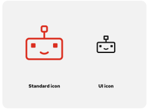
</figure>

## Variations

Using a robot to represent AI chatbots opens up new possibilities for using variations of the robot to express personality and add whimsy.

- Consider using chatbot icon variations or animations to show thinking states, react to content, or differentiate chatbot options, depending on technical limitations.
- The UI icon robot does not have variations due to size constraints.
- Existing variations include: happy chatbot (default), annoyed chatbot, bewildered chatbot, and sad chatbot.

> [!NOTE]
> More robot variations can be created as needed. To request a new one, chat us on Slack at #help-brand.

<figure data-type="example">
  
  <figcaption>Happy chatbot (default)</figcaption>
</figure>

<figure data-type="example">
  
  <figcaption>Annoyed chatbot</figcaption>
</figure>

<figure data-type="example">
  
  <figcaption>Bewildered chatbot</figcaption>
</figure>

<figure data-type="example">
  
  <figcaption>Sad chatbot</figcaption>
</figure>

## Chatbot avatars in use

The robot icon should be consistent, but can be styled as needed to provide an engaging experience in each chatbot application.

- Use the UI size version of the happy chatbot for avatars and launch buttons.
- The sizes of the avatar variants vary from small, medium, and large.
- If the `pf-chatbot` is using compact sizing then the avatar will adopt the compact size variant.

<figure data-type="example">
  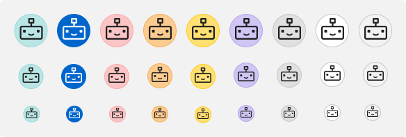
  <figcaption>Chatbot avatar color variants on a light theme background</figcaption>
</figure>

<figure data-type="example">
  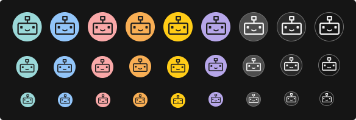
  <figcaption>Chatbot avatar color variants on a dark theme background</figcaption>
</figure>

> [!NOTE]
> Avatar variants are using PatternFly's non-status tokens. We advise against using success-green, interaction-blue, and danger-red.

## Chatbot launch button

When clicking a button results in opening a conversation with a chatbot, use the robot icon on the button.

### Primary and secondary examples

- We recommend using the UI Icon sizing for the launch CTA and the avatar.
- Launch button variants are using PatternFly tokens; choose the variant that accommodates your product needs best, considering the page background color versus the icon button color.
- The visual execution of the 'Launch' CTA is context-dependent and should follow local product area patterns.

### Contextual examples

- We recommend using the UI Icon sizing for the launch CTA and the avatar.
- Contextual examples show possible launch button styling using masthead items, icon buttons, and menu toggles.
- Choose the variant and launch location that best suits your product UI.

<figure data-type="example landscape">
  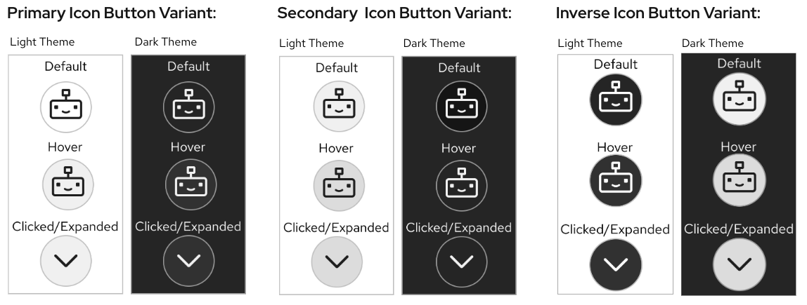
  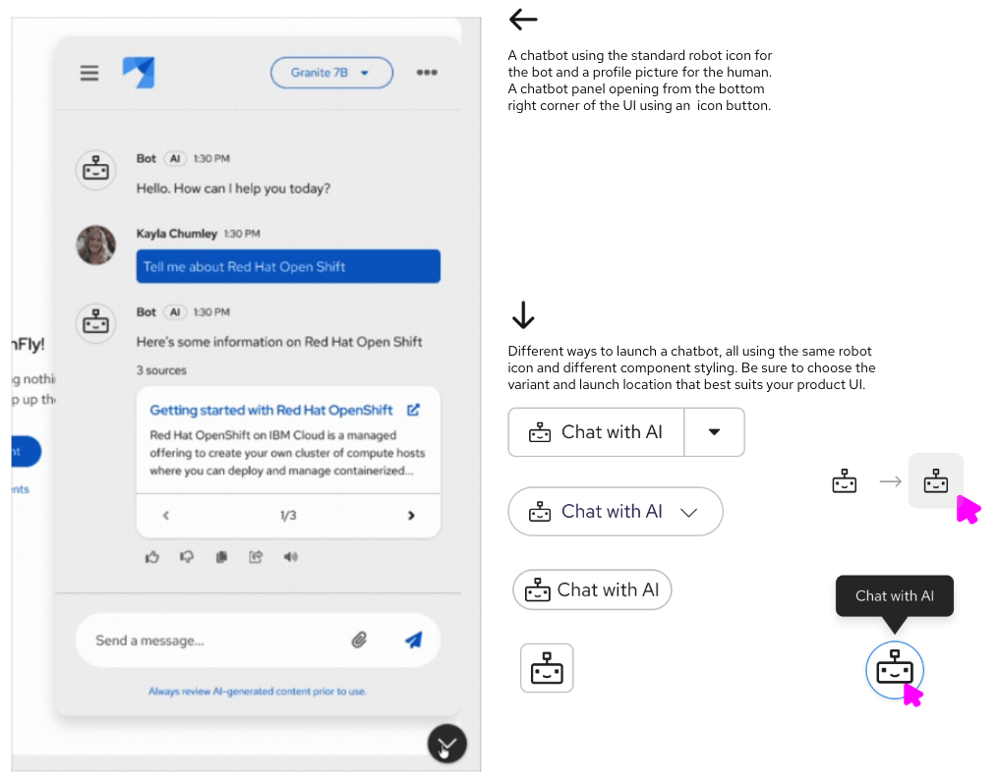
</figure>

## Chatbot avatar don'ts

<figure data-type="dont">
  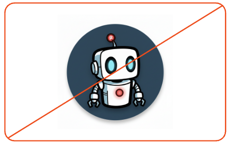
  <figcaption>Don't use other icons or robots as chatbot avatars.</figcaption>
</figure>

<figure data-type="dont">
  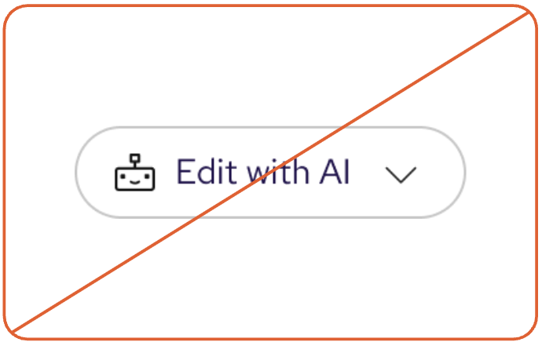
  <figcaption>Don't use robot icons to represent other kinds of AI experiences.</figcaption>
</figure>

<figure data-type="dont">
  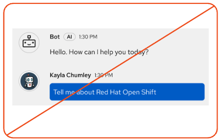
  <figcaption>Don't use robot icons to represent humans.</figcaption>
</figure>

<figure data-type="dont">
  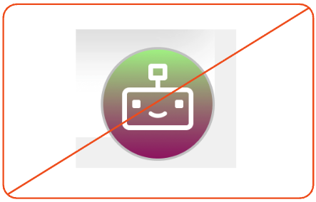
  <figcaption>Don't change the styling of launch buttons to use a gradient fill or border gradient.</figcaption>
</figure>

<figure data-type="dont">
  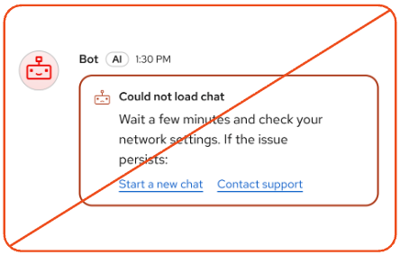
  <figcaption>Don't use robot variations to indicate state changes or alerts.</figcaption>
</figure>

<figure data-type="dont">
  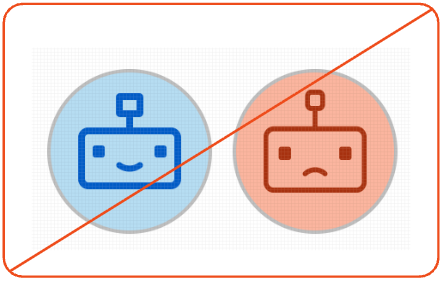
  <figcaption>Don't change the color of the robot icon based on the "emotion" of the variation.</figcaption>
</figure>
