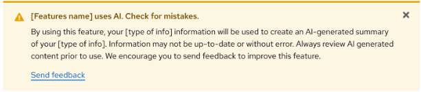
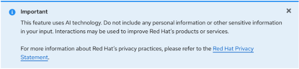
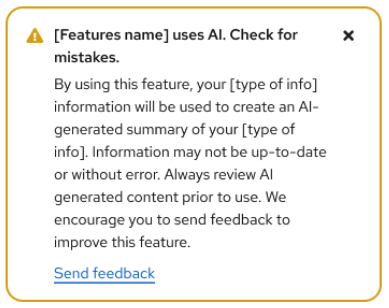
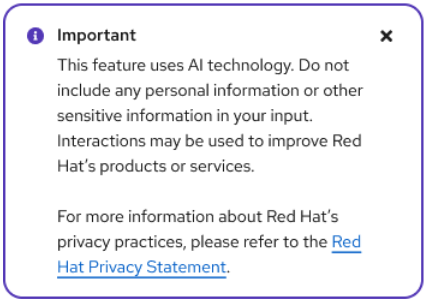
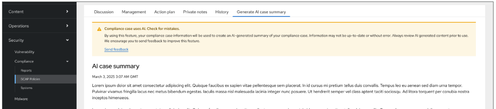
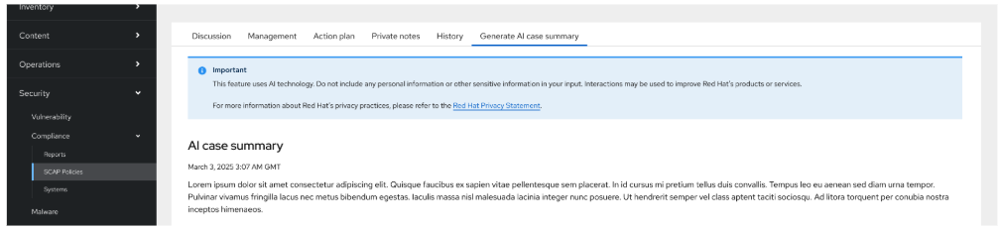
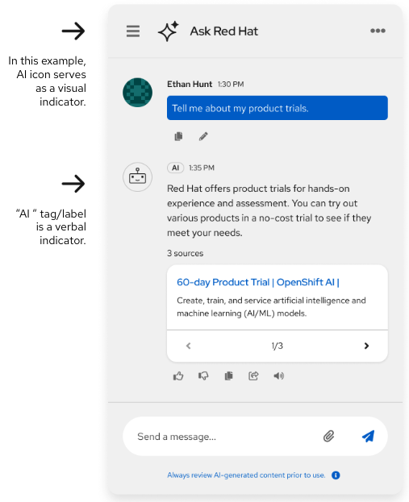
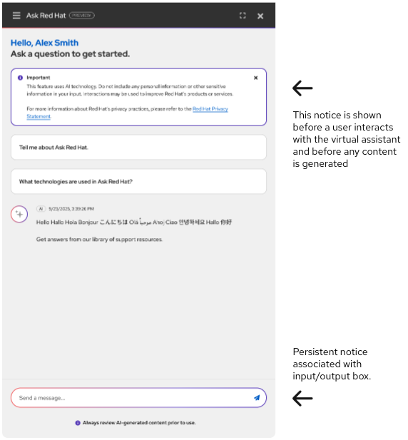
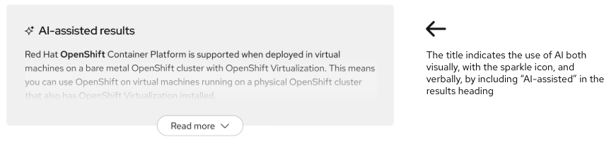
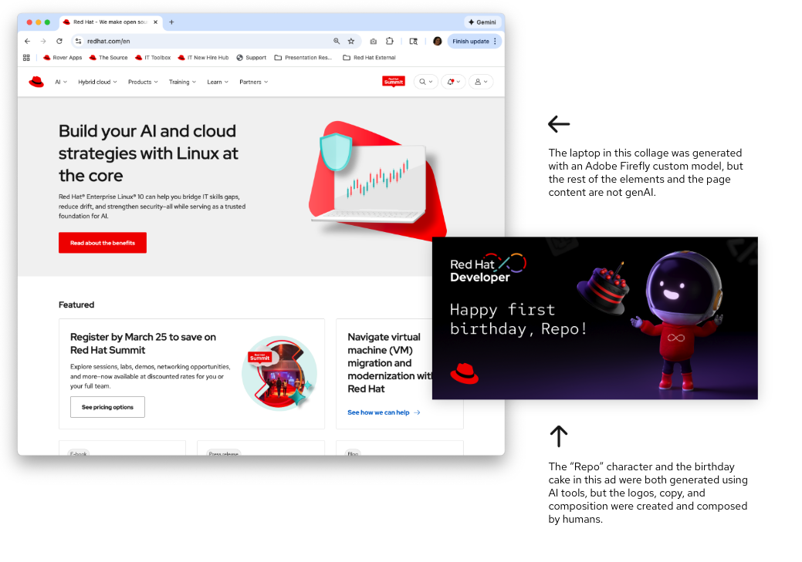

## It should always be clear when and how AI is being used

[User research](https://url.corp.redhat.com/ai-sentiment-survey) has shown that users want to clearly see when an action that they will take involves AI. Err on the side of over-communicating about AI features.

- Don't rely on just one form of indicator for AI-enabled experiences.
- At minimum use one visual and one verbal indicator, including options like icons, "with AI" button text, animations, and text disclaimers.
- Consider additional indicators for high-risk interactions. Consult with the AIA Reviewers during your AIA review process as needed.

## Transparency components for AI-related features

These components are used to notify users when they are interacting with AI-related features. They also inform users that generated responses may contain inaccuracies and advise them not to provide personal information, as AI systems may retain data for future improvements.

- Common UX practices suggest placing the icon before the disclosure helps users more easily notice and recognize the message.
- Tooltips are not included in these messages.
- The label and notification style may vary depending on the context in which the information appears.
- Please [refer to the guidance](https://url.corp.redhat.com/notices-external-facing-ai-enabled-features) for more details on notification messages.

### Inline alerts

Use inline alerts to surface AI disclosures directly within the page context.

<figure data-type="example">
  
  <figcaption>Warning variant: notify users that a feature uses AI and that they should review AI-generated content prior to use.</figcaption>
</figure>

<figure data-type="example">
  
  <figcaption>Info variant: advise users not to include personal or sensitive information, as AI systems may retain data.</figcaption>
</figure>

### Toast alerts

Use toast alerts for more prominent AI disclosures, such as when a feature is first accessed.

<figure data-type="example">
  
  <figcaption>Warning variant: inform users that their information will be used to create an AI-generated summary and that output may not be up-to-date or without error.</figcaption>
</figure>

<figure data-type="example">
  
  <figcaption>Info variant: remind users not to include personal information, and link to the Red Hat Privacy Statement for more information.</figcaption>
</figure>

## Transparency notices for AI-assisted features

Some AI-assisted features may warrant more than an icon and text label. In these cases, a text notice can be placed at the beginning of an experience.

- The text for this notice may vary or be tailored to the content.
- For external-facing AI features, [refer to this guidance](https://url.corp.redhat.com/notices-external-facing-ai-enabled-features) and work with your AIA Reviewers during the AIA review process.

<figure data-type="example landscape">
  
  <figcaption>A warning notice placed above AI-generated content, alerting users to check for mistakes.</figcaption>
</figure>

<figure data-type="example landscape">
  
  <figcaption>An info notice placed above AI-related tools, reminding users not to include sensitive information.</figcaption>
</figure>

## Transparency notices for virtual assistants

- Include a notice at the beginning of an experience stating, at a minimum: "This feature uses AI technology. Do not include any personal information or other sensitive information in your input." (This notice is shown before a user interacts with the virtual assistant and before any content is generated.)
- Include a persistent notice under the 'i' icon: "Always review AI-generated content prior to use." (This is a persistent notice associated with the input/output box.)
- For external-facing AI features, [refer to this guidance](https://url.corp.redhat.com/notices-external-facing-ai-enabled-features).

<figure data-type="example">
  
  <figcaption>The AI icon in the header bar serves as a visual indicator, and the "AI" tag/label is a verbal indicator.</figcaption>
</figure>

<figure data-type="example">
  
  <figcaption>A notice shown before the user interacts with the virtual assistant, with a persistent notice associated with the input/output box.</figcaption>
</figure>

## Indicating AI-generated content

AI-generated content, like a search results summary, must include a label and an icon indicating to the user that the content has been created using AI.

<figure data-type="do">
  
  <figcaption>The title indicates the use of AI both visually, with the sparkle icon, and verbally, by including "AI-assisted" in the results heading.</figcaption>
</figure>

## Indicating AI-generated images

AI-generated images or ads should not be labeled individually.

- Visually indicating each image would be distracting and could cause users to assume that entire images or pages are created without human influence, as seen in the responses to our AI sentiment survey.
- Instead, Red Hat is working on a site-wide notice that will outline when users will (and won't) encounter AI-generated images on Red Hat web properties.

<figure data-type="example">
  
  <figcaption>

- The laptop in this collage was generated with an Adobe Firefly custom model, but the rest of the elements and the page content are not genAI.
- The "Repo" character and the birthday cake in this ad were both generated using AI tools, but the logos, copy, and composition were created and composed by humans.

  </figcaption>
</figure>
